# JiraMaster

**Turn AI-summarised meeting notes into structured Jira Epics & Stories — in four steps.**

JiraMaster is a Flask web application that bridges the gap between your AI assistant (GitHub Copilot, ChatGPT, etc.) and Jira Cloud. Paste meeting notes, generate a tuned prompt, feed it to your LLM, then import, review, and push the resulting Epics and Stories directly to Jira — no coding required.


---

## Table of Contents

- [Overview](#overview)
- [Landing Page](#landing-page)
- [Architecture](#architecture)
- [Data Flow](#data-flow)
- [Installation](#installation)
- [Configuration](#configuration)
- [Usage — 4-Step Workflow](#usage--4-step-workflow)
  - [Step 1: Generate a Prompt](#step-1-generate-a-prompt)
  - [Step 2: Import LLM Output](#step-2-import-llm-output)
  - [Step 3: Edit Epics & Stories](#step-3-edit-epics--stories)
  - [Step 4: Upload to Jira](#step-4-upload-to-jira)
- [Jira Tools](#jira-tools)
- [Cache Manager](#cache-manager)
- [Advanced Topics](#advanced-topics)
- [Project Structure](#project-structure)
- [Troubleshooting](#troubleshooting)
- [License](#license)

---

## Overview

JiraMaster solves a common pain point: after a meeting, you have Copilot or ChatGPT produce a structured YAML summary of decisions and action items, but getting that into Jira as properly-linked Epics and Stories is tedious. JiraMaster automates the last mile:

1. **Generate** a tunable prompt tailored to your meeting notes
2. **Import** the YAML/JSON output your LLM produces
3. **Edit** every field — titles, acceptance criteria, assignees, labels, priorities, due dates
4. **Upload** directly to Jira Cloud via REST API v3
5. **Browse** a landing page that surfaces all modules with quick-access links

No database. No migrations. Works out of the box with `./scripts/start.sh`.

---

## Architecture

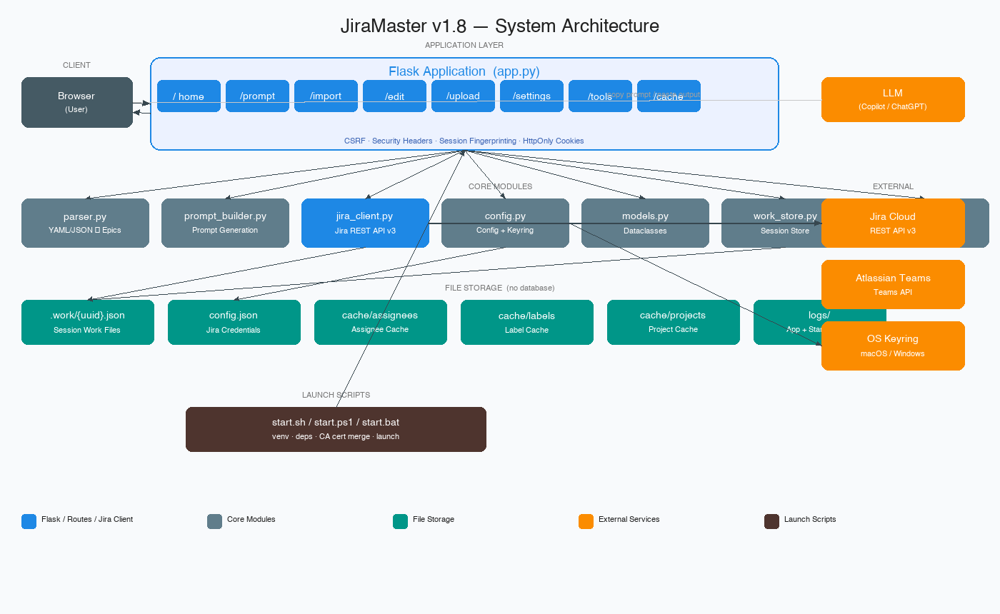

| Layer | Components |
|-------|-----------|
| **Client** | Browser — interacts with the Flask web UI |
| **Application** | Flask 3.x app (`app.py`) with 8 route blueprints: `/` (home), `/prompt`, `/import`, `/edit`, `/upload`, `/settings`, `/tools`, `/cache` |
| **Core Modules** | `parser.py`, `prompt_builder.py`, `jira_client.py`, `config.py`, `models.py`, `work_store.py`, `logging_config.py` |
| **File Storage** | `.work/{uuid}.json` per session; `cache/` directory for assignees, labels, projects; `config.json` — no database |
| **External** | Jira Cloud (REST API v3), Atlassian Teams API, OS Keyring (macOS Keychain / Windows Credential Manager), and your LLM of choice |
| **Launch Scripts** | `scripts/start.sh` (macOS/Linux) and `scripts/start.ps1` + `scripts/start.bat` (Windows) — manage venv, deps, TLS cert merging |

### Key Design Decisions

- **No database** — each session is a UUID-keyed JSON file in `.work/`. Zero migrations, trivially portable.
- **Include flags** — `Epic.include` and `Story.include` booleans let you exclude any item before upload.
- **ADF dual-mode** — acceptance criteria are written in Atlassian Document Format (ADF); falls back to plain text if the field doesn't support ADF.
- **TLS proxy support** — `scripts/start.sh`/`scripts/start.ps1` merge your system CA certificates into the certifi bundle automatically, so corporate TLS-inspection proxies work without admin rights.
- **Centralised logging** — all modules use `logging.getLogger(__name__)`; a single `setup_logging()` call in `app.py` routes everything to a rotating file log and console.
- **Secure credential storage** — API tokens can be stored in the OS keyring (macOS Keychain, Windows Credential Manager) instead of plaintext `config.json`.
- **Security hardening** — all responses carry CSP, X-Frame-Options, and X-Content-Type-Options headers; session cookies are HttpOnly, SameSite=Lax, 8-hour lifetime; work-file access is validated against a session fingerprint.

---

## Data Flow

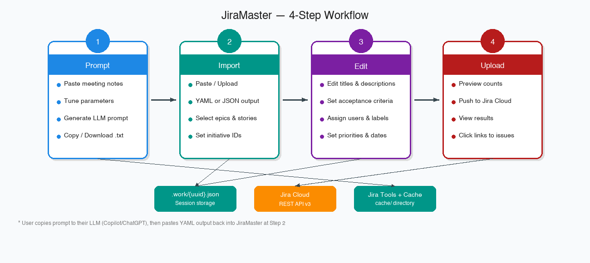

```
Meeting Notes (optional)
        │
        ▼
┌───────────────────┐
│  Step 1: Prompt   │  ← Tune aggressiveness, story count, detail level
│  /prompt          │  → Download .txt or copy to clipboard
└────────┬──────────┘
         │ (manual: paste into Copilot / ChatGPT)
         ▼
    LLM produces YAML
         │
         ▼
┌───────────────────┐
│  Step 2: Import   │  ← Paste YAML/JSON or upload file
│  /import          │  → Select epics, set initiative IDs
└────────┬──────────┘
         │ saved to .work/{uuid}.json
         ▼
┌───────────────────┐
│  Step 3: Edit     │  ← Edit all fields: titles, AC, assignees, labels
│  /edit            │  → Updated in .work/{uuid}.json
└────────┬──────────┘
         │
         ▼
┌───────────────────┐
│  Step 4: Upload   │  ← Preview counts, then push
│  /upload          │  → Jira Cloud REST API v3
└───────────────────┘
         │
         ▼
  Jira Epics & Stories created
```

---

## Installation

### Prerequisites

- **Python 3.9+**
- A **Jira Cloud** instance with API access
- A Jira **API token** (see [Configuration](#configuration))

### macOS / Linux

```bash
git clone https://github.com/your-username/JiraMaster.git
cd JiraMaster
./scripts/start.sh
```

`scripts/start.sh` will:
1. Create a Python virtual environment (`venv/`)
2. Install all dependencies from `requirements.txt` (including `keyring`)
3. Merge system CA certificates into the certifi bundle (for TLS-inspection proxies)
4. Start the app at **http://127.0.0.1:5000**

### Windows

```bat
git clone https://github.com/your-username/JiraMaster.git
cd JiraMaster
scripts\start.bat
```

`scripts/start.bat` launches `scripts/start.ps1` with `-ExecutionPolicy Bypass`, so it works on corporate machines without admin rights or policy changes. CA certs are merged from `Cert:\CurrentUser\Root`, `Cert:\LocalMachine\Root`, and `Cert:\LocalMachine\CA`.

> **Advanced:** If you have already configured your own PowerShell execution policy, you can run `.\scripts\start.ps1` directly instead.

### Manual Installation

```bash
python3 -m venv venv
source venv/bin/activate          # Windows: venv\Scripts\activate
pip install -r requirements.txt
python app.py
```

### Dependencies

| Package | Purpose |
|---------|---------|
| `Flask >= 3.0` | Web framework |
| `Flask-WTF >= 1.2` | CSRF protection |
| `PyYAML >= 6.0.1` | Parse LLM YAML output |
| `requests >= 2.31` | Jira REST API calls |
| `certifi >= 2024` | CA certificate bundle |
| `keyring >= 25.0` | OS keyring for secure credential storage |

---

## Configuration

On first run, open **http://127.0.0.1:5000/settings** to enter your Jira credentials.

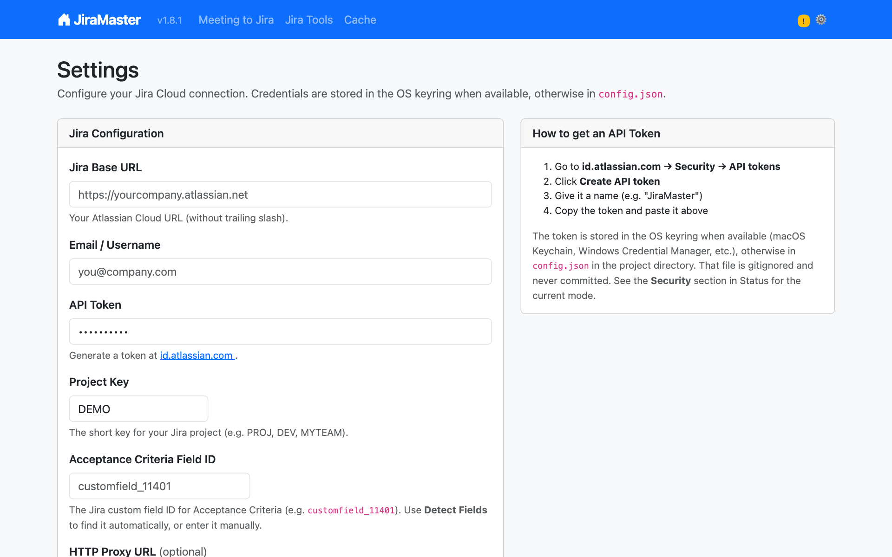

| Field | Description |
|-------|-------------|
| **Jira Base URL** | Your Atlassian Cloud URL, e.g. `https://yourcompany.atlassian.net` |
| **Email / Username** | The email address of your Atlassian account |
| **API Token** | Generate at [id.atlassian.com](https://id.atlassian.com) → Security → API tokens |
| **Project Key** | The short key for your Jira project (e.g. `PROJ`, `DEV`) |
| **Acceptance Criteria Field ID** | Custom field ID for AC (e.g. `customfield_11401`). Use **Detect Fields** to find it automatically. |
| **HTTP Proxy URL** | Optional. For corporate proxies: `http://proxy.company.com:8080` |

Credentials are saved to `config.json` in the project directory (gitignored). If the OS keyring is available, the API token is stored there instead of in plaintext.

### Security Status

The Settings page shows a **Security Status** panel with:
- **Credential storage mode** — `keyring` (secure) or `config file` (plaintext)
- **SSL configuration** — whether a custom CA bundle or proxy is active
- **API token state** — whether a token is stored and where

### Getting a Jira API Token

1. Go to **https://id.atlassian.com** → Security → API tokens
2. Click **Create API token**
3. Give it a name (e.g. `JiraMaster`) and copy the token
4. Paste it into the **API Token** field in Settings

### Detecting the Acceptance Criteria Field

If your Jira project uses a custom AC field, click **Detect Fields** in Settings. JiraMaster will inspect your project's issue create metadata and find fields whose name contains "acceptance" or "criteria".

---

## Landing Page

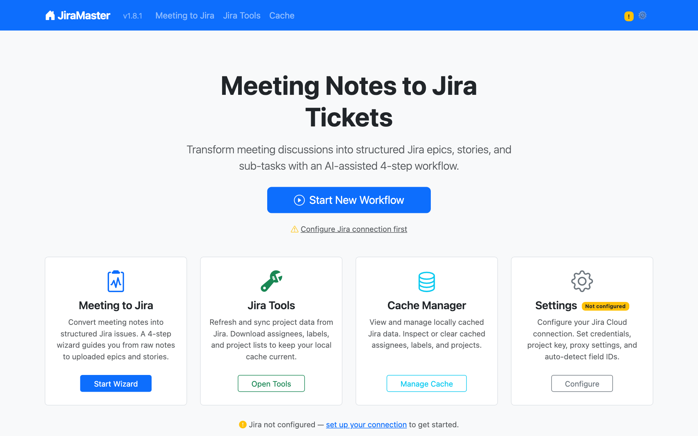

Navigate to **http://127.0.0.1:5000** to reach the landing page. It provides quick access to all modules:

- **Meeting to Jira** — start the 4-step wizard
- **Jira Tools** — refresh cached project data
- **Cache Manager** — inspect and clear local caches
- **Settings** — configure your Jira connection

The navbar's home icon (JiraMaster) returns to this page from anywhere in the app.

---

## Usage — 4-Step Workflow

### Step 1: Generate a Prompt

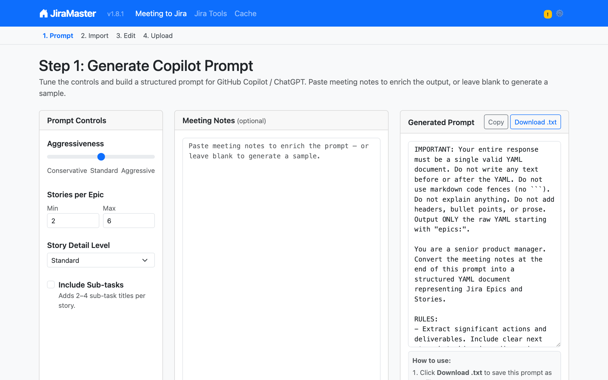

Navigate to **Meeting to Jira** in the top nav (or **http://127.0.0.1:5000/prompt**).

**Controls:**

| Control | Options | Effect |
|---------|---------|--------|
| **Aggressiveness** | Conservative / Standard / Aggressive | How many action items to extract. Conservative = explicit decisions only; Aggressive = all action items including tentative ones. |
| **Stories per Epic** | Min / Max (numbers) | Tells the LLM how many stories to generate per epic. |
| **Story Detail Level** | Brief / Standard / Detailed | Brief = title + description only; Standard = all fields; Detailed = rich acceptance criteria with examples. |
| **Include Sub-tasks** | Checkbox | Adds 2–4 sub-task title suggestions per story. |

**Steps:**
1. Paste your meeting notes into the **Meeting Notes** textarea (or leave blank for a sample prompt)
2. Adjust the controls
3. Click **Generate Prompt** — the right panel updates with the tailored prompt
4. Click **Copy** to copy to clipboard, or **Download .txt** to save
5. Paste the prompt into GitHub Copilot, ChatGPT, or any LLM

---

### Step 2: Import LLM Output

#### 2a — Paste or Upload

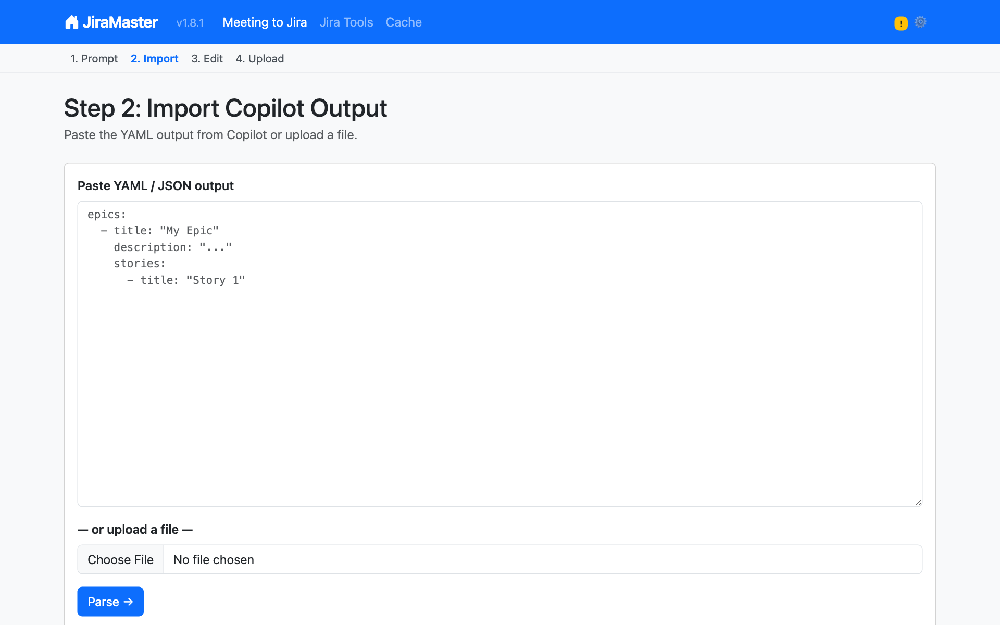

Paste the YAML/JSON your LLM produced, or upload a `.yaml`/`.json`/`.txt` file.

**Expected YAML structure:**

```yaml
epics:
  - title: "User Authentication System"
    description: "Implement secure login with SSO support"
    acceptance_criteria: "Users can log in. Sessions expire after 8 hours."
    due_date: "2026-06-30"
    priority: "High"          # Low | Medium | High | Critical
    assignee: "Alice Johnson"
    comment: "From sprint planning"
    stories:
      - title: "Login page UI"
        description: "Build the login form with validation"
        acceptance_criteria: "Form validates email format."
        due_date: "2026-05-15"
        priority: "High"
        assignee: "Bob Smith"
```

Click **Parse →** to import.

#### 2b — Review & Select

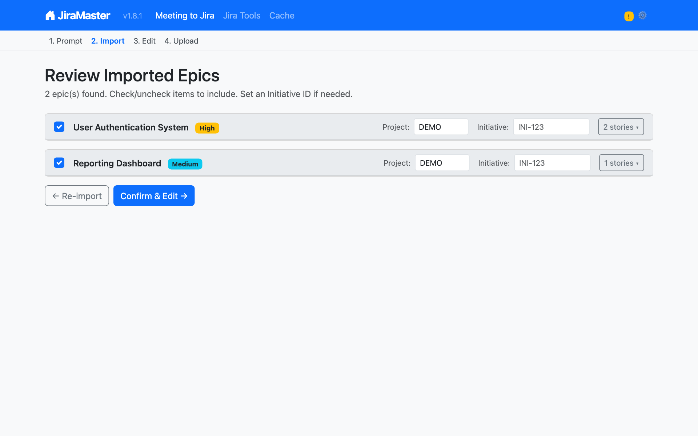

After parsing, you see a list of epics with checkboxes. Here you can:

- **Check/uncheck** epics and stories to include or exclude them from upload
- Set an **Initiative ID** (the Jira key of a parent epic, e.g. `PROJ-42`) to link epics
- Override the **Project Key** per epic if you're targeting multiple projects

Click **Confirm & Edit →** to proceed.

---

### Step 3: Edit Epics & Stories

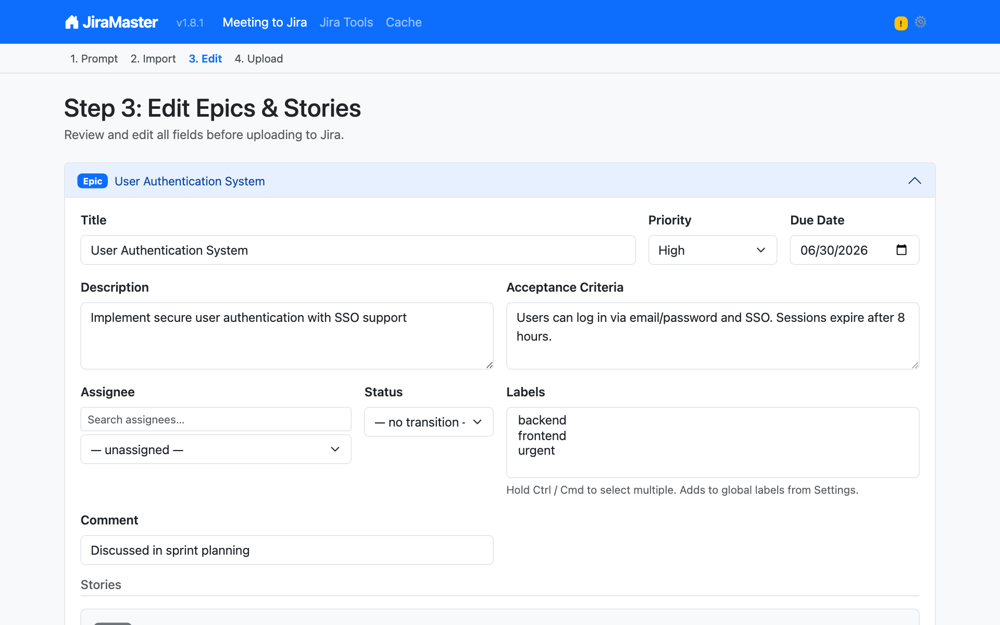

Fine-tune every field before upload. Each epic is an expandable card showing:

| Field | Notes |
|-------|-------|
| **Title** | Free text |
| **Description** | Free text |
| **Acceptance Criteria** | Posted as a Jira comment in ADF format |
| **Assignee** | Autocomplete from cached Jira users (refresh in Jira Tools) |
| **Status** | Target status after creation (e.g. "In Progress") |
| **Priority** | Low / Medium / High / Critical |
| **Due Date** | YYYY-MM-DD |
| **Labels** | Multi-select from cached Jira labels |
| **Comment** | Optional additional comment posted to the issue |

Stories are nested under their parent epic. Assignee inherits from the epic if left blank on the story.

Click **Save & Continue →** when done.

---

### Step 4: Upload to Jira

#### 4a — Preview

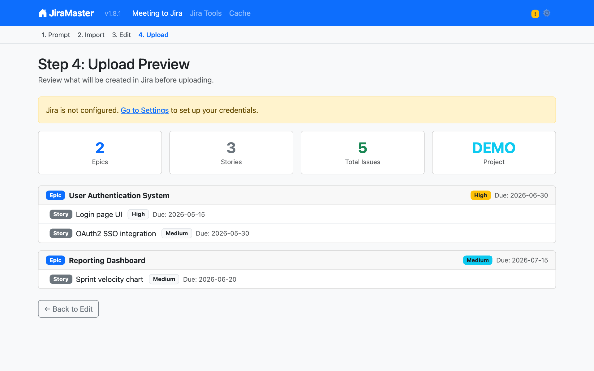

Review the summary before pushing: epic count, story count, total issues, and target project. Each epic is listed with its included stories, priorities, due dates, and initiative links.

Click **Upload to Jira** when ready.

#### 4b — Results

After upload, each issue is shown with:
- ✓ **Success** — with a clickable Jira issue key link
- ✗ **Failure** — with the error message from the API

For each epic/story, JiraMaster:
1. Creates the Jira issue (Epic or Story with parent link)
2. Transitions it to the requested status (if set)
3. Posts acceptance criteria as a comment (ADF format, with plain-text fallback)
4. Posts the optional extra comment

---

## Jira Tools

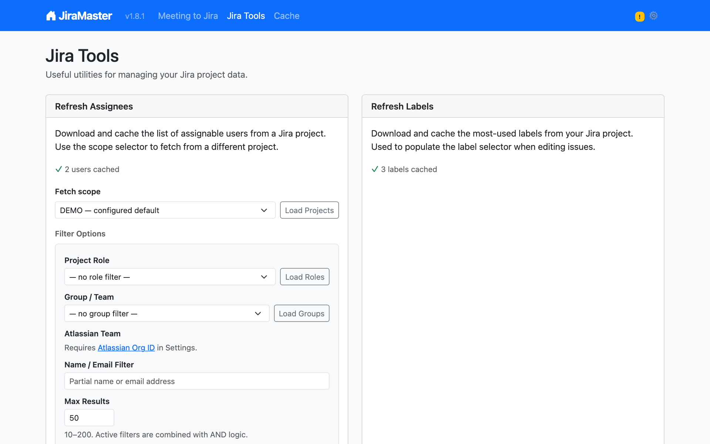

Navigate to **Jira Tools** in the top nav.

### Refresh Assignees

Fetches assignable users from Jira and caches them to `assignees.json` for use in the Edit step.

**Fetch Scope** — use **Load Projects** to pick a project other than your configured default.

**Filter Options** — narrow the user list before caching:

| Filter | How to use |
|--------|-----------|
| **Project Role** | Click **Load Roles** to populate the dropdown, then select a role (e.g. `Developer`, `Viewer`) |
| **Group / Team** | Click **Load Groups** to populate the dropdown, then select your team's Jira group |
| **Name / Email Filter** | Type a partial name or email to search within assignable users |
| **Max Results** | Limit the cache size (10–200, default 50) |

Filters are combined with AND logic. If all filters together return 0 users, the cache is not updated.

### Refresh Labels

Fetches the top 40 most-used labels from Jira and caches them to `labels.json`.

Run **Refresh Assignees** and **Refresh Labels** once after setup, and again whenever your team membership or label set changes.

---

## Cache Manager

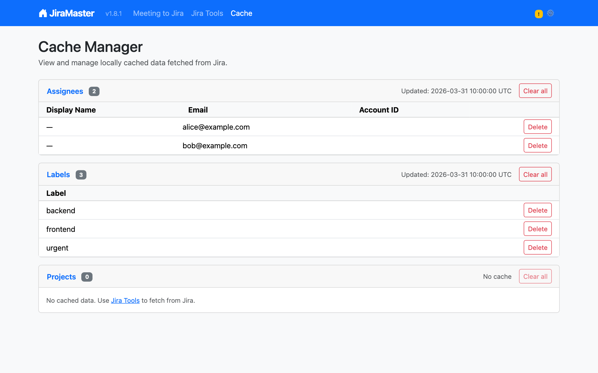

Navigate to **Cache** in the top nav (or **http://127.0.0.1:5000/cache**).

The Cache Manager shows the current state of all locally cached Jira data:

| Cache | Contents | Source |
|-------|----------|--------|
| **Assignees** | Jira assignable users (display name, email, account ID) | Jira Tools → Refresh Assignees |
| **Labels** | Top 40 most-used project labels | Jira Tools → Refresh Labels |
| **Projects** | Accessible Jira project list | Jira Tools → Load Projects |

For each cache you can:
- View item count and last-fetched timestamp
- **Delete** individual entries
- **Clear all** entries in a cache

Caches are stored in the `cache/` directory as JSON files with metadata headers.

---

## Advanced Topics

### Debug Mode

```bash
FLASK_DEBUG=1 ./scripts/start.sh
```

Enables:
- Flask debug toolbar and auto-reload
- `DEBUG`-level console logging (normally only `INFO`)

Windows:
```powershell
$env:FLASK_DEBUG="1"; .\scripts\start.ps1
```

### Corporate TLS Proxy

If your organisation uses TLS inspection, the start scripts automatically merge your system's CA certificates into the certifi bundle so `requests` trusts your proxy's certificate.

You can also set the proxy URL in **Settings → HTTP Proxy URL**.

If you need to set it manually:
```bash
export REQUESTS_CA_BUNDLE=/path/to/your/ca-bundle.crt
```

### Secure Credential Storage

JiraMaster uses the OS keyring to store your Jira API token when available:
- **macOS** — stored in Keychain
- **Windows** — stored in Credential Manager
- **Linux** — stored via `keyring` (requires a keyring backend such as `SecretService`)

If no keyring backend is available, the token falls back to plaintext in `config.json`. The Settings page shows which mode is active in the **Security Status** panel.

### Acceptance Criteria Field

JiraMaster auto-detects your AC custom field. If auto-detection fails:

1. Go to **Settings → Detect Fields** to try again
2. Or find the field ID manually: in Jira, open an issue, right-click the AC field → Inspect → look for `customfield_NNNNN`
3. Enter it directly in **Settings → Acceptance Criteria Field ID**

### Multiple Sessions

Each browser session gets its own UUID, so multiple users can work independently at the same time. Work files accumulate in `.work/` — clean them up periodically with:

```bash
rm .work/*.json
```

### Logging

Logs are written to `logs/jiramaster.log` (rotating, 5 MB max, 3 backups) and `logs/startup.log`. Both are gitignored.

---

## Project Structure

```
JiraMaster/
├── app.py                  # Flask app factory, CSRF, blueprint registration
├── config.py               # Load/save config.json; prompt template management; keyring integration
├── models.py               # Dataclasses: Epic, Story, JiraConfig, UploadResult, Priority
├── jira_client.py          # All Jira REST API v3 calls (create, transition, comment, groups, roles)
├── parser.py               # Parse YAML/JSON LLM output → Epic/Story objects
├── prompt_builder.py       # Build tunable prompts (aggressiveness, detail, story count)
├── logging_config.py       # Centralised logging (rotating file + console)
├── work_store.py           # Centralised session work-file access with fingerprint validation
├── assignees.py            # Assignee cache helpers (reads/writes cache/assignees.json)
├── labels.py               # Label cache helpers (reads/writes cache/labels.json)
│
├── routes/
│   ├── prompt.py           # /prompt — generate & download prompt
│   ├── import_view.py      # /import — paste/upload and parse LLM output
│   ├── edit.py             # /edit — edit all epic/story fields
│   ├── upload.py           # /upload — preview and push to Jira
│   ├── settings.py         # /settings — Jira credentials, field config, security status
│   ├── tools.py            # /tools — refresh assignees/labels, fetch projects/roles/groups
│   └── cache_manager.py    # /cache — view and manage local caches
│
├── templates/              # Jinja2 templates (one subdirectory per blueprint)
│                           #   home/, prompt/, import/, edit/, upload/, settings/, tools/, cache_manager/
├── static/
│   ├── style.css           # Bootstrap 5.3 overrides
│   └── app.js              # Clipboard copy, story toggles, cascade checkbox logic
│
├── scripts/
│   ├── start.sh            # Launch script: macOS/Linux
│   ├── start.ps1           # Launch script: Windows
│   ├── start.bat           # Windows batch wrapper
│   ├── update.ps1          # Windows updater (git pull + restart)
│   └── update.bat          # Windows update batch wrapper
│
├── data/
│   └── prompt_template.txt # Default LLM prompt template
│
├── docs/
│   └── images/             # Architecture diagrams and app screenshots
│
├── .claude/
│   ├── hooks/              # Auto-commit and major-release confirmation hooks
│   ├── rules/              # Enforced development rules (loaded by Claude Code)
│   └── settings.json       # Project permissions and hook wiring
│
├── requirements.txt        # Python dependencies
└── VERSION                 # Current version string
```

**Runtime files (gitignored):**

| Path | Purpose |
|------|---------|
| `config.json` | Jira credentials and settings |
| `.secret_key` | Flask session secret (auto-generated) |
| `cache/assignees.json` | Cached Jira assignable users |
| `cache/labels.json` | Cached Jira labels |
| `cache/projects.json` | Cached Jira project list |
| `.work/{uuid}.json` | In-progress session work files |
| `logs/jiramaster.log` | Rotating application log |
| `logs/startup.log` | Startup diagnostics |

---

## Troubleshooting

### "Jira is not configured"
Go to **Settings** and enter your Jira URL, email, API token, and project key. Click **Test Connection** to verify.

### SSL / Certificate errors
Your network may use TLS inspection. The start scripts handle this automatically, but if you see `SSL: CERTIFICATE_VERIFY_FAILED`:
1. Re-run `./scripts/start.sh` — it merges system CA certs on every start
2. Or set `REQUESTS_CA_BUNDLE=/path/to/bundle.crt` manually before running

### "Field not found" / AC not posting
The acceptance criteria field ID may be wrong or missing. Go to **Settings → Detect Fields** to auto-detect it. If detection fails, find the field ID in Jira's issue create screen source and enter it manually.

### No assignees in autocomplete
Go to **Jira Tools → Refresh Assignees**. If the list is empty after refresh:
- Ensure your API token has permission to browse users in the target project
- Try using the **Group / Team** filter to fetch a specific group instead of all assignable users
- Try the **Project Role** filter to narrow the pool

### Load Groups / Load Roles returns nothing
Your Jira account may not have permission to list groups or roles. Check with your Jira administrator. The Name / Email filter can be used as an alternative to fetch users by partial name.

### Parse errors on import
- Ensure your LLM output starts with `epics:` (YAML) or `{"epics":` (JSON)
- Strip any preamble text before pasting — the LLM sometimes adds "Here is the YAML:" before the content
- Try **Detail Level: Standard** in Step 1 if the LLM keeps adding extra fields

### Cache Manager shows empty caches
Go to **Jira Tools** and run **Refresh Assignees** and **Refresh Labels** first. The Cache Manager only shows data that has been fetched at least once.

### Keyring not available
On Linux, `keyring` requires a backend (e.g. `gnome-keyring`, `kwallet`, or `pass`). If none is installed, credentials fall back to `config.json` automatically — no action needed. The Settings page shows current credential storage mode.

---

## License

This project is licensed under the **GNU General Public License v3.0**. See [LICENSE](LICENSE) for details.
